# Dataset Cartography — Re-implementation & Extension

CS-162 final project built on [Swayamdipta et al., EMNLP 2020](https://aclanthology.org/2020.emnlp-main.746/). This repo **reproduces the paper’s analyses** (data maps, subset selection, ablations, noise & uncertainty) in a modular, student-readable codebase—and **extends** cartography to new models, tasks, and training regimes.

**Paper figures/tables:** [`paper_outputs/`](paper_outputs/) · **Extra experiments:** [`extension_outputs/`](extension_outputs/)

---

## Abstract

We re-implemented Dataset Cartography end-to-end: per-epoch dynamics logging, adaptive region labeling, subset export, multi-GPU retraining, and paper-style plotting. On WinoGrande and subsampled NLI runs we recover the paper’s qualitative trends—**easy / hard / ambiguous** map regions; **ambiguous** and **hard-to-learn** 33% slices beating high-confidence baselines on OOD proxies; **easy-to-learn** examples required for optimization in small ambiguous-only sets; label-noise shifts toward low confidence; confidence correlating with human agreement.

**Our contributions (beyond the paper):** (1) modular `ml_cartography/` + `scripts/00–13` with tmux launchers and W&B/CSV export; (2) **multi-architecture** SNLI maps; (3) **preference** and **dynamic curriculum** cartography; (4) **bilateral 1% label-flip** probe extending §5 mislabel detection with region transition matrices and detector cross-eval; (5) automated `paper_outputs/` and `extension_outputs/` collection.

---

## Results gallery

<sub>Click filenames for full resolution.</sub>

**Data maps (§2)** — SNLI · WinoGrande

<p align="center">
  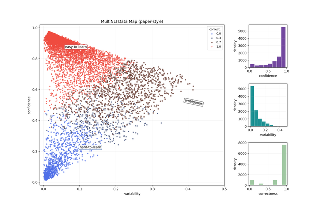
  &nbsp;
  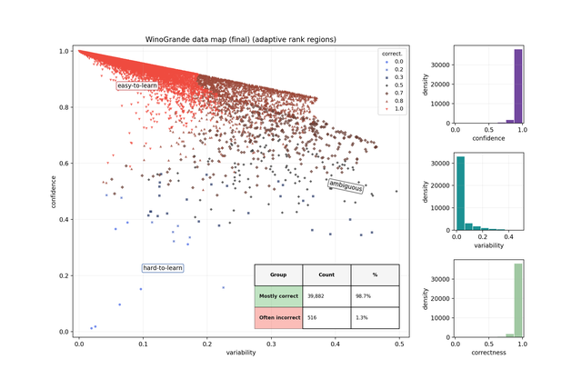
</p>

**Subset selection (§3)**

<p align="center">
  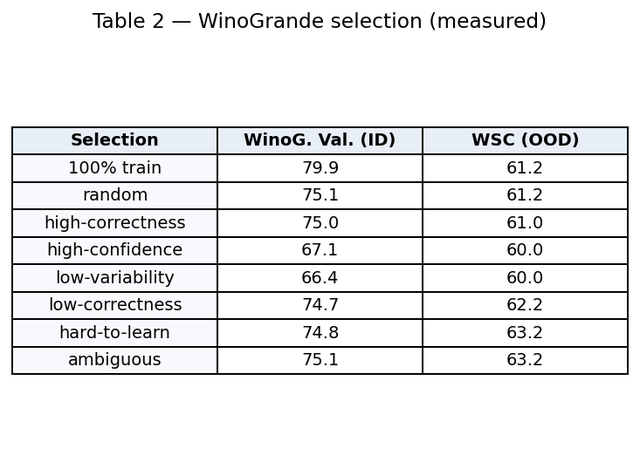
  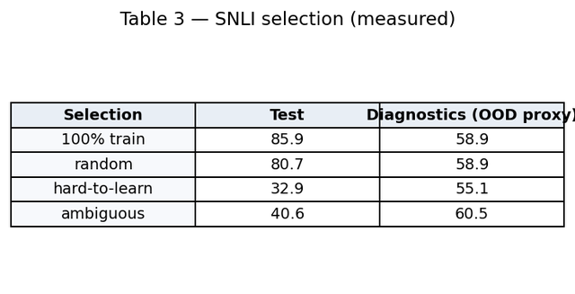
  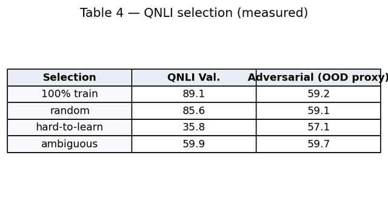
</p>

**Ambiguous scaling & noise (§4–§5)**

<p align="center">
  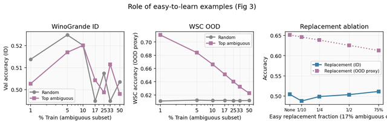
</p>

<p align="center">
  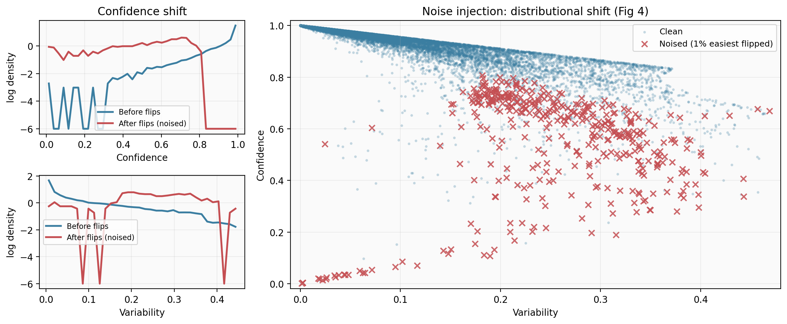
</p>

**Human agreement (§6)**

<p align="center">
  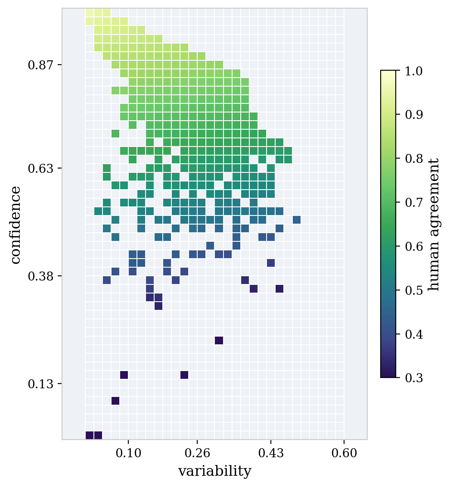
</p>

| Takeaway | Measured signal |
|----------|-----------------|
| Map structure | Three regions stable across SNLI & WinoGrande |
| Table 2 | ambiguous OOD **63.2%** vs random **61.2%** |
| Fig 4 | Noised easy examples shift to low-confidence |
| Fig 5 | High-confidence bins → high human agreement |

---

## Extra experiments

Four extensions beyond the paper body. Figures in [`extension_outputs/`](extension_outputs/).

| # | Experiment | Goal | Key outputs |
|---|------------|------|-------------|
| **1** | Multi-architecture SNLI maps | Map structure vs encoder capacity | Region-mix bars + side-by-side maps (DistilBERT, RoBERTa-base) |
| **2** | Preference cartography | RLHF-style chosen/rejected dynamics | Preference data map (confidence × variability) |
| **3** | Dynamic curriculum (Idea #2) | Per-epoch region drift + adaptive sampling | Region-fraction curve; epoch 1→final transition matrix |
| **4** | **Bilateral 1% label flip** | Stronger §5 proof that hard region may harbor mislabels | Easy vs hard injection arms, region cross-eval, detector confusion matrix |

<p align="center">
  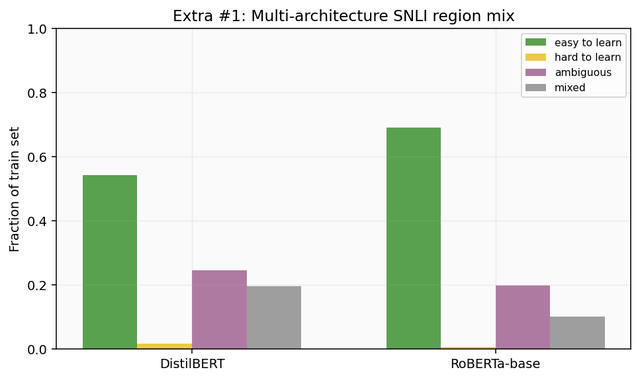
  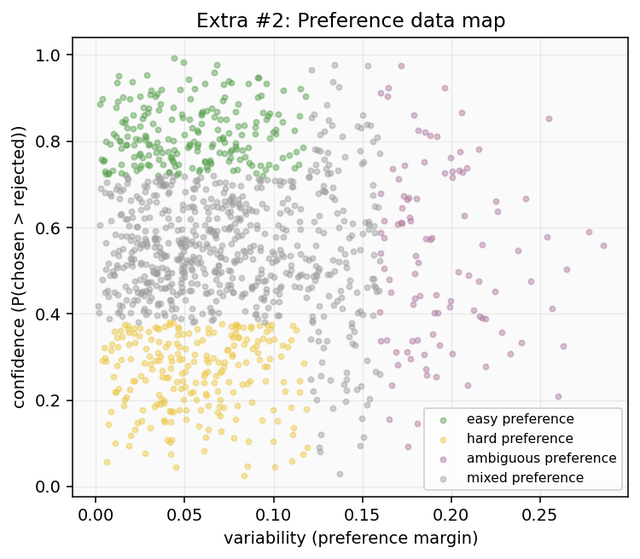
  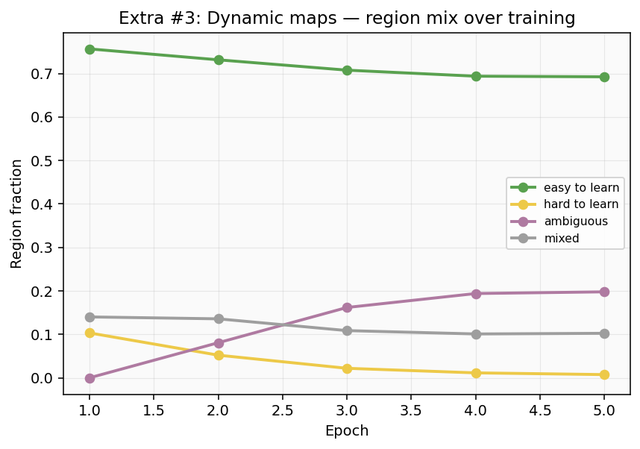
</p>

<p align="center">
  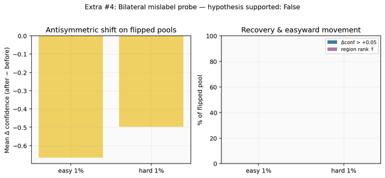
  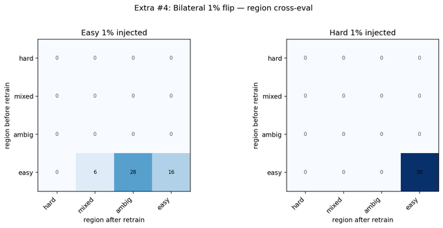
  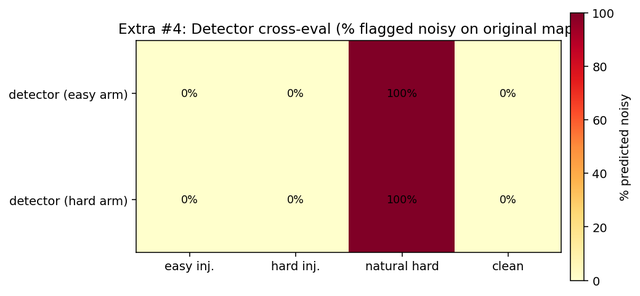
</p>

**Extra #4** mirrors paper §5 at **1% flip rate** on both arms: easy-injected (paper) vs hard-injected (extension). Metrics include antisymmetric confidence shift, % recovered (Δconf > 0.05), region transition matrices, and detector cross-eval on original map cohorts.

```bash
# tmux + 5-GPU hard-arm restarts + W&B + per-epoch progress
GPUS=0,1,2,3,4 RESTARTS=5 bash scripts/run_exp_11_extra_bilateral_noise.sh

# Regenerate all extension figures (1–4)
python scripts/collect_extension_outputs.py
```

Artifacts: `data/processed/bilateral_noise_flip/analysis_summary.json`

---

## Repo layout

```
ml_cartography/       core library (dynamics, maps, extension_figures, paper_tables)
scripts/              00–13 pipeline, run_exp_01–11, collect_*_outputs.py
paper_outputs/        Figure_* and Table_* (paper reproduction)
extension_outputs/    Extra_01–04_* (extension experiments)
results/              timestamped runs + region_metrics_*.json
data/processed/       bilateral_noise_flip/, noise_detection_paper/, finetune artifacts
```

**Regenerate paper outputs:** `python scripts/plot_from_metrics_csv.py --no-wandb && python scripts/collect_paper_outputs.py`

---

## Quick start

```bash
bash scripts/setup_conda_env.sh && conda activate cs162-cartography
pip install -r requirements-train.txt

python scripts/run_cartography_experiment.py --task snli --preset roberta-base --epochs 3
python scripts/collect_paper_outputs.py
python scripts/collect_extension_outputs.py
```

Paper experiments: [`scripts/EXPERIMENT_LAUNCHERS.md`](scripts/EXPERIMENT_LAUNCHERS.md)

---

## Citation

```bibtex
@inproceedings{swayamdipta2020dataset,
  title={Dataset Cartography: Mapping and Diagnosing Datasets with Training Dynamics},
  author={Swayamdipta, Swabha and others},
  booktitle={EMNLP}, year={2020}
}
```
